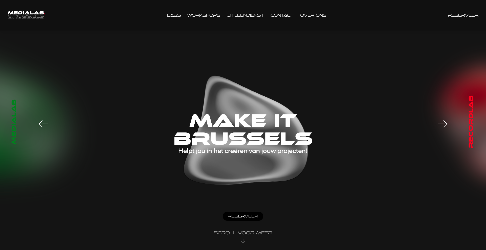

# Project_Title

Website Make it.Brussels

## Description

De bedoeling van ons project is om een website te maken over medialab.brussel
Het is een onderling van Erasmus hogeschool Brussel waarin alle labs zijn van de school.
Op de site moet je alles kunnen weten over wie ze zijn, de 3 labs met al zijn machines, de workshops, de uitleendienst en een reserveer pagina.

Dit project is ontstaan wan het gedeelte Medialab.Brussels wou een aparte website hebben om een nieuw doelpubliek aan te spreken en te informeren. Die mensen gaan dan alle features kunnen gebruiken zoals bestellingen en participeren aan activiteiten.

Ons doelpubliek is vooral externe mensen of ze nu kennis hebben in multimedia zoals proffesionelen/docenten of mensen zonder kennis
zoals studenten/leerkrachten.
We willen een afstellen van de ip Erasmus Hogeschool en de site zijn eigen identiteit geven door er een futuristishe vibe te geven.
die vibe hebben we dan toegepast op de hele site en geeft goed aan waar de site over gaat.

# Getting_Started
## Table_Of_Contents

- [Project_Title](#Project_Title)
- [Description](#Description)
- [Getting_Started](#Getting_Started)
- [Requirements](#Requirements)
- [Usage](#Usage)
- [Features](#Features)
- [Screenshot](#Screenshot)
- [Authors](#Authors)
- [Build_With](#Build_With)
- [Contributing](#Contributing)
- [Roadmap](#roadmap)
- [Color_Reference](#Color_Reference)
- [Badges](#Badges)
- [Testing](#Testing)
- [Installation](#Installation)
- [License](#License)
- [Acknowledgements](#Acknowledgements)
- [Support](#Support)

## Requirements

- Windows 10
- Windows 11
- MacOS

## Usage

Het project is de website Make It.Brussels en je kan op andere paginas gaan om reserveringen te maken, aan workshops meedoen en toestellen uitlenen.


## Features

- Reserveer een workshop
- Leen iets via uitleendienst
- Contactformulier voor help/projecten

## Screenshot




## Authors

- [@ArnoBaeck](https://github.com/ArnoBaeck)
- [@SophiaRahmoun ](https://github.com/SophiaRahmoun)
- [@MatteoGiambarresi](https://github.com/MatteoGiambarresi)
- [@Ralf564](https://github.com/Ralf564)
- [@AhmedBelaouchi](https://github.com/AhmedBelaouchi)


## Build_with

- Visual Studio Code


## Contributing

### Guidelines

1. Maak een nieuwe branch aan
2. Maak uw veranderingen (Bv. Nieuwe html en css)
3. Maak een pull request aan

! Regel: Niet aan een andere code komen zonder dat anderen er op de hooggte van zijn om zo merge conflicts te vermijden


## Roadmap

- In de toekomst zouden we de bubbels (home page en andere paginas) willen animeren om de layout interesanter en dynamieker te maken.

## Color_Reference

| Color             | Hex                                                                |
| ----------------- | ------------------------------------------------------------------ |
| Black |  #000000 |
| Lighter Black |  #1F1F1F |
| White |  #FFFFFF |
| Grey |  #6F6F6F |
| Red |  #FF0000 |
| Purple |  #9D00FF |
| Green |  #1DA814 |


## Badges


## Testing

- Via Github [https://legendary-adventure-22ogk4v.pages.github.io/]
## Installation

Install our project with HTTPS or dowload ZIP via Github.

```bash
  [https://github.com/EHB-MCT/full-projects-2-2023-2024-lab1-mct]
```
    
## License

This project is licensed under the [Erasmushogeschoolbrussel] License - (https://www.erasmushogeschool.be/en)


## Acknowledgements

- **[Design Ispiration](https://www.pinterest.com/)** - Design ispiraties voor website design.
- **[Slider code](https://www.w3schools.com/jquery/jquery_slide.asp)** - Hulp nodig gehad om een simpele slider aan te maken.
- **[Dropdown menu code](https://www.w3schools.com/howto/howto_css_dropdown.asp)** - Support voor een dropdown menu onder labs
- **[Responsive Navigation Bar Optimization](https://chatgpt.com/share/41d589c8-ab9a-4c87-8a09-3fb939d6380b)** - Hulp om navigatie responsief te maken.
- **[Footer inside .wrapper](https://chatgpt.com/share/244626ce-962d-42ac-969e-433417343aad)** - hulp nodig gehad om Footer te maken
- **[Responsive Image Size Adjustments](https://chatgpt.com/share/8bd805ef-0d56-4478-85dd-7f97808a44b3)** - Afbeelding responsief maken.
- **[Centreren Afbeelding Zonder Overflow](https://chatgpt.com/share/38e50030-e7d2-4b1e-84de-c6b522bde562)** - Overflow probleem helpen fixen.
- **[CSS Code Review](https://chatgpt.com/share/245f9d2c-4368-4223-8b91-284985323102)** - Minor bug fixes en algemene verbetering.
- **[Download Attribute](https://www.w3schools.com/tags/att_a_download.asp)** - Hulp om pdfs downloadable te maken.
- **[Fix Radio Buttons Dropdown](https://chatgpt.com/share/6e4ed95d-f275-417d-9eb0-a36b8d0e1364)** - Buttons placements fix.
- **[Sorteer API-items op knopnamen](https://chatgpt.com/share/63fc8376-9616-449d-9e21-e1d069d1b1e2 )** - Api sort functie fixen
- **[Aligneer afbeeldingen in kolommen.](https://chatgpt.com/share/bd2116b4-25a4-4e99-870f-30a928a2473f)** - Hulp bij maken van kolommen.
- **[Range Sliders](https://www.w3schools.com/howto/howto_js_rangeslider.asp)** - aanmaak van slider.

## Support

gwendolyn.vander.putten@ehb.be
